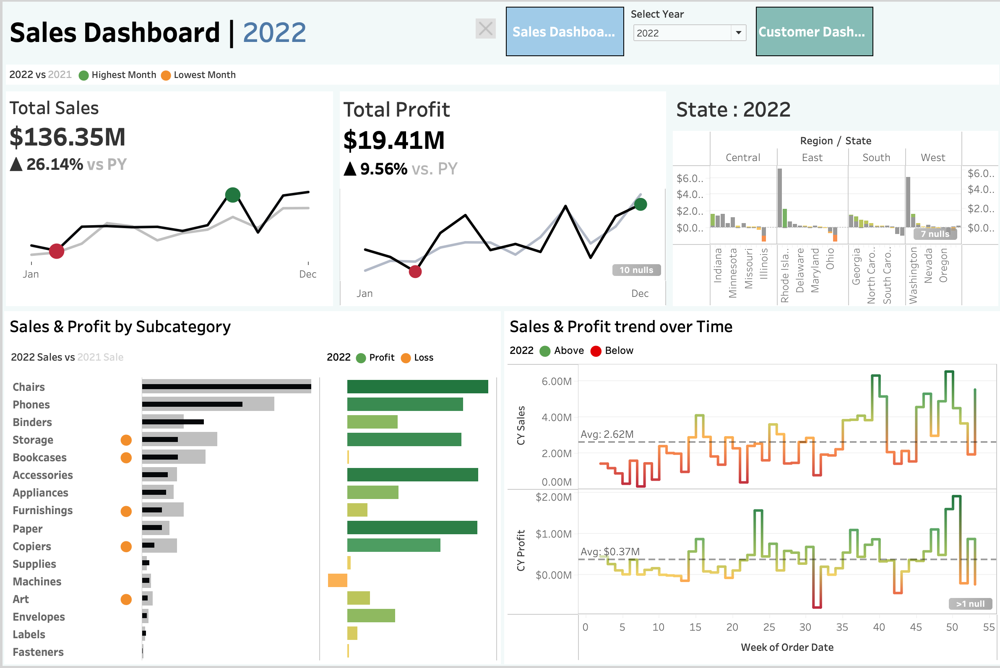

Here’s a brief and professional summary of your **Sales Dashboard | 2022**:

---

### 📊 Sales Dashboard Summary – 2022

**Overview:**
The dashboard presents a comprehensive view of **2022 sales and profitability**, showing year-over-year growth, regional/state breakdowns, subcategory analysis, and weekly performance trends.

---

#### 🔹 Key KPIs:

* **Total Sales:** \$136.35M ▲ 26.14% vs. 2021
* **Total Profit:** \$19.41M ▲ 9.56% vs. 2021
* **Peak Month:** December | **Lowest Month:** January

---

#### 🔹 Regional & State Performance:

* Performance varies across regions, with **Central and East** showing higher sales.
* Some states contain null values, indicating incomplete data.

---

#### 🔹 Subcategory Insights:

* Top-performing subcategories: **Phones, Chairs, Copiers**
* Loss-making subcategories: **Machines, Art, Binders, Labels, Fasteners**
* Profit is color-coded:

  * 🟩 Green = Profit
  * 🟧 Orange = Loss

---

#### 🔹 Weekly Trends:

* Sales and profit fluctuate weekly, with stronger performance in Q4.
* Sales crossed the weekly average of **\$2.62M** in several late-year weeks.
* Profit remained above the **\$0.37M** weekly average during peak periods.

---

#### 📌 Insights:

* The business has **grown significantly** year-over-year.
* Focus is needed on underperforming subcategories.
* End-of-year seasonality plays a major role in boosting overall sales.

---

Let me know if you'd like this turned into a Markdown `.md` snippet or included in a report format.
