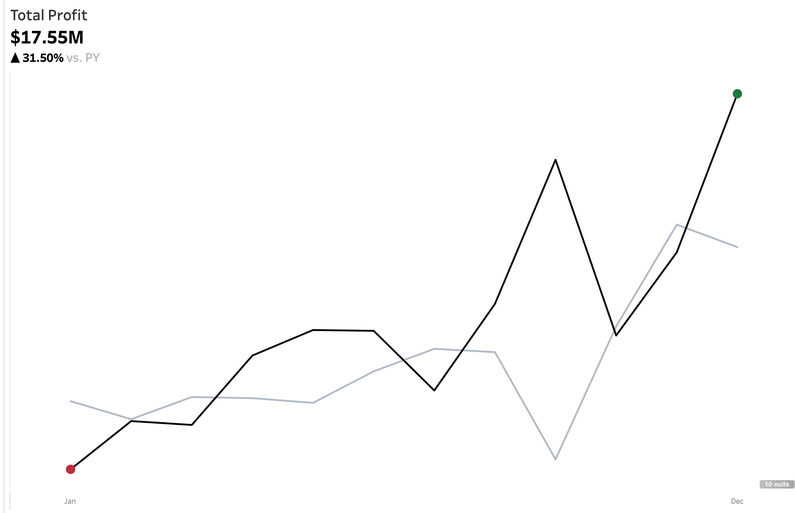
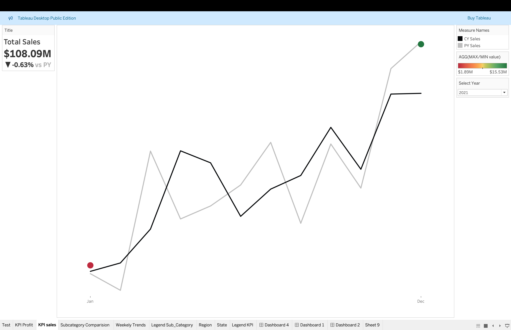

Here's a full breakdown of the three Tableau dashboards you shared, which you can use in your resume or portfolio to demonstrate your data visualization, analysis, and storytelling skills:

---

### 📊 **1. KPI Dashboard: Total Profit**

**total_profit.png)**

#### **Overview**

* **Metric Displayed**: **Total Profit**
* **Current Value**: **\$17.55M**
* **YoY Change**: **▲ 31.50% vs. Previous Year (PY)**
* **Visualization**: Dual-line chart (black = current year, gray = previous year)

#### **Visual Details**

* **Trendline**: Black line for CY (Current Year) profit across months, with a red dot at the lowest point (January) and a green dot at the highest point (December).
* **Benchmark Line**: Faint gray line represents the PY (Previous Year) monthly profit trend for comparison.

#### **Insights**

* Profit increased sharply toward the end of the year.
* The 31.5% YoY increase indicates strong financial growth.
* Clear seasonality can be observed, especially a major spike toward Q4, suggesting possible promotional or holiday-driven revenue.

---

### 📊 **2. KPI Dashboard: Total Sales**

****

#### **Overview**

* **Metric Displayed**: **Total Sales**
* **Current Value**: **\$108.09M**
* **YoY Change**: **▼ -0.63% vs. PY**
* **Visualization**: Dual-line chart (black = CY Sales, gray = PY Sales)

#### **Visual Details**

* Black line represents monthly sales in the current year.
* Gray line represents monthly sales in the previous year.
* Start and end values are highlighted with red (min) and green (max) dots.
* The difference is subtle, but the negative growth shows a slight underperformance.

#### **Insights**

* Although the total sales value is high, there's a **decline of 0.63%**, suggesting issues in sales growth compared to last year.
* Despite some high months, the current year failed to consistently outperform last year.
* Useful for identifying which months underperformed and investigating causes.

---

### 📊 **3. Weekly Trends Dashboard**

**Image 3**

#### **Overview**

* **Metrics Displayed**:

  * **Top Chart**: CY Sales by week
  * **Bottom Chart**: CY Profit by week
* **Time Period**: Weekly data for the year **2021**
* **Color Coding**:

  * **Sales** (top chart) colored by sales value
  * **Profit** (bottom chart) colored by profit value
  * **Red to Green** gradient indicates poor to excellent performance

#### **Visual Details**

* **Dashed Lines**: Represent the **average** value for Sales (\$2.04M) and Profit (\$0.34M).
* **Color**:

  * Red = Low performance
  * Yellow = Mid-range
  * Green = High performance

#### **Insights**

* Sales are generally above average in the second half of the year.
* Several weeks show strong sales but weak profit, indicating potential issues with cost management or discounting.
* Profit volatility is higher than sales, which may require operational or pricing adjustments.

---

### ✅ **How to Describe on a Resume**

> **Built interactive Tableau dashboards to monitor and analyze KPIs such as Total Sales, Total Profit, and Weekly Trends. Used YoY comparisons and color-encoded charts to reveal actionable insights, identify seasonal performance trends, and highlight growth opportunities. Visualizations supported executive decision-making by summarizing millions in revenue and profit performance.**

Or more concise:

> **Developed KPI dashboards in Tableau showing YoY profit growth (+31.5%) and weekly sales trends, using dynamic color-coding and multi-layered line charts to highlight seasonal patterns and operational inefficiencies.**

---

If you'd like help writing a portfolio description or case study around this project, I can help you structure that as well.
